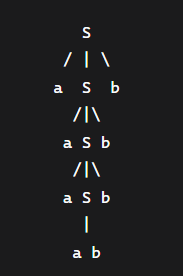

# Gramática Independiente de Contexto (GIC)

## Ejercicios conceptuales

1. ¿Qué Lenguaje Formal genera la gramática G = <{S, T}, {a, b}, {S -> aT, T -> a, T -> λ}, S>? Justifique

Lenguaje generado: L = {aa, a}

Justificación:

Desde S: S → aT

Luego T puede derivar:

T → a: obtenemos "aa"

T → λ: obtenemos "a"

No hay otras derivaciones posibles

Por lo tanto: L(G) = {a, aa}

2. Sea la Gramática Formal con producciones: {S -> aT | bQ,  T -> a | b,  Q -> a | λ} ¿La gramática con estas seis producciones genera la palabra bab? 
Justifique. ¿Cuál es el Lenguaje Formal generado por esta gramática? Justifique

No, no genera "bab".

Justificación:

Única forma de empezar con "b": S → bQ

De Q → a: obtenemos "ba"

De Q → λ: obtenemos "b"

No hay producción que permita agregar más símbolos después de Q

Para obtener "bab" necesitaríamos derivar tres símbolos, pero todas las derivaciones terminan máximo en dos pasos

Lenguaje formal generado:
L = {aa, ab, ba, b}

Justificación:

S → aT → aa = "aa"

S → aT → ab = "ab"

S → bQ → ba = "ba"

S → bQ → bλ = "b"

3. ¿Una GR es siempre una GIC? Justifique. ¿Una GIC es siempre una GR? Justifique

Sí, siempre.

Justificación:
Por la Jerarquía de Chomsky:

GR = Lenguajes Regulares (Tipo 3)

GIC = Lenguajes Independientes del Contexto (Tipo 2)

Todo lenguaje regular es independiente del contexto

La clase de gramáticas regulares está contenida en la clase de gramáticas independientes del contexto

¿Una GIC es siempre una GR?
No, no siempre.

## Ejercicios derivaciones

1. ¿Cuál es la mínima palabra generada por la GIC {S -> aSb | a}? Justifique. ¿Cuál es la palabra que le sigue en longitud?

Mínima palabra generada: "a"
Siguiente en longitud: "aab"

2. Dada la GIC: {S -> λ; S -> AaB; S -> BbA; A -> a; A -> aAa, A -> bAa; B -> b; B -> bBb; B -> aBb}. Cadena más corta y varias cadenas del lenguaje

Cadena más corta: λ (cadena vacía)

Justificación: S → λ directamente

Varias cadenas del lenguaje:

S → AaB → a(a)b = aab

S → AaB → a(aAa)b = aaaab

S → BbA → b(b)a = bba

S → BbA → b(bBb)a = bbbba

S → AaB → bAa(a)b = baab

Patrón: Parece generar cadenas con patrones simétricos alrededor de "a" o "b" centrales.

3. Dada la GIC: {S -> [A]; A -> a; A -> aaA}. Cadena más corta y varias cadenas del lenguaje

Cadena más corta: "[a]"

Justificación:

S → [A] → [a]

Longitud: 3 caracteres ([, a, ])

Otras cadenas del lenguaje:

S → [A] → [aaA] → [aaa] = "[aaa]"

S → [A] → [aaA] → [aaaaA] → [aaaaa] = "[aaaaa]"

S → [A] → [aaA] → [aaaaA] → [aaaaaaA] → [aaaaaaa] = "[aaaaaaa]"

Patrón: "[a^(2n+1)]" donde n ≥ 0 (cantidad impar de 'a' entre corchetes)

4. Dada la GIC P = {S -> aSb | ab}, determine, aplicando una derivación horizontal, si la cadena aaabbbb es una palabra del LIC generado por esta GIC. Dibuje la misma derivación, pero en forma de árbol

Derivación horizontal:
S → aSb → a(aSb)b → a(a(ab)b)b = aaabbbb 



5. Supongamos un Lenguaje de Programación en el que sus expresiones aritméticas están formadas por los números enteros 2 y 6, el operador de suma y siempre termina con un “punto y coma”. Algunas expresiones aritméticas de este Lenguaje de Programación son: {6; 2+2+6;} Vamos a construir una GIC que genere la totalidad de estas expresiones aritméticas. Para ello, debemos definir el vocabulario de no terminales, el vocabulario de terminales, el axioma y el conjunto de producciones. Supongamos que el vocabulario de no terminales esta formado por: S (el axioma), E (de expresión) y T (de término). Los terminales son 2, 6, + y ; (punto y coma). Las producciones de la GIC que genera el lenguaje de estas expresiones aritméticas son: {S -> E;  E -> T | E + T   T -> 2 | 6}. Determine, aplicando derivación a:
      1. izquierda, si 6; es una expresión correcta
      2. izquierda, si 6+6+6+; es una expresión correcta
      3. derecha, si 6+6+6+; es una expresión correcta
      4. izquierda, si 6+6+6+2; es una expresión correcta

      S -> E;
      E -> T | E + T
      T -> 2 | 6

      1. Derivación por izquierda:
            S → E; → T; → 6;
            SÍ es correcta - Se deriva completamente: 6;

      2. ¿6+6+6+; es una expresión correcta? - Derivación por izquierda
            Intentemos derivación por izquierda:
            S → E; → E + T; → E + T + T; → T + T + T; → 6 + T + T; → 6 + 6 + T; → 6 + 6 + 6;

      3.Problema: Nos quedó 6 + 6 + 6; pero la cadena es 6+6+6+; (tiene un + extra al final).

      No hay producción que permita un + solitario al final.

      NO es correcta

      3. ¿6+6+6+; es una expresión correcta? - Derivación por derecha

      Derivación por derecha:

      S → E; → E + T; 

      Ya nos detenemos aquí porque necesitaríamos expandir T pero tenemos un + suelto.

      NO es correcta - Mismo problema que antes.

      4. ¿6+6+6+2; es una expresión correcta? - Derivación por izquierda

      Derivación por izquierda:

      S → E; 
      → E + T; 
      → E + T + T; 
      → E + T + T + T; 
      → T + T + T + T; 
      → 6 + T + T + T; 
      → 6 + 6 + T + T; 
      → 6 + 6 + 6 + T; 
      → 6 + 6 + 6 + 2; 
      
      SÍ es correcta - Se deriva completamente: 6+6+6+2;

6. Dada la siguiente gramática ambigua, G=({S,B}, {0,1}, S, P), donde P son las producciones, P = {(S -> 0BB), (B -> 1S), (B -> 0S), (B -> 0)}. Mostrar los diferentes árboles de derivación para la cadena 010000000

      S -> 0BB
      B -> 1S | 0S | 0

      Cadena: 010000000
              
        S
       /|\
      0 B B
        | /|\
        1S 0 B
       /|\   |
      0 B B  0
        | /|\
        0 0 B
            |
            0

      Derivación: S → 0BB → 0(1S)B → 01(0BB)B → 010(0)(0B)B → 01000(0)B → 010000(0) = 010000000

      Árbol de derivación 2:

        S
       /|\
      0 B B
        | /|\
        0S 0 B
       /|\   |
      0 B B  0
        | /|\
        1 0 B
            |
            0        

      Derivación: S → 0BB → 0(0S)B → 00(0BB)B → 000(1)(0B)B → 00010(0)B → 000100(0) = 010000000

      Revisemos la cadena: 010000000 (9 caracteres)

      Revisemos la cadena: 010000000 (9 caracteres)

      La gramática genera cadenas que empiezan con 0, luego dos B's. Cada B puede expandirse de diferentes maneras, creando la ambigüedad.             


7. Dada la siguiente gramática ambigua, G=({E}, {+, \*, cte}, E, P), donde P son las producciones, P = {(E -> E + E), (E -> E \* E), (E -> cte)}. Derivar la cadena: cte + cte \* cte, mostrando los diferentes árboles de derivación


      Gramática: G = ({E}, {+, *, cte}, E, P)

      Producciones:

      E -> E + E | E * E | cte

      Cadena: cte + cte * cte

      Árbol de derivación 1 (suma primero):

        E
       /|\
      E + E
      |  /|\
     cte E * E
         |   |
        cte cte

      Interpretación: (cte + cte) * cte

        E
       /|\
      E * E
     /|\   |
    E + E cte
    |   |
   cte cte

      Interpretación: cte + (cte * cte)
      
      Conclusión:

      Ambas gramáticas son ambiguas porque generan la misma cadena con múltiples árboles de derivación, lo que implica múltiples interpretaciones (especialmente importante en expresiones aritméticas donde el orden de operaciones afecta el resultado).
   
   En el ejercicio 7, la ambigüedad es particularmente problemática porque:

      Árbol 1: (cte + cte) * cte

      Árbol 2: cte + (cte * cte)

      Estos dan resultados numéricos diferentes. Para eliminar la ambigüedad, se necesitaría definir precedencia de operadores o usar una gramática no ambigua.

8. Dada la siguiente Gramática Formal:

      ```plain
      Identificador -> Letra | Identificador Letra | Identificador GuiónBajo Letra
      GuiónBajo -> _
      Letra -> A | B | C | ... | Z
      ```

      1. Construya el árbol de derivación para generar el identificador R_X_A

                   Identificador
              /             |        \
      Identificador       GuiónBajo  Letra
            /       |   \       |      |
      Identificador _ Letra     _         A
         |              |
       Letra             X
         |
         R

         Identificador → Identificador GuiónBajo Letra
               → Identificador GuiónBajo Letra GuiónBajo Letra
               → Letra GuiónBajo Letra GuiónBajo Letra
               → R _ Letra _ A
               → R _ X _ A
               → R_X_A
               

      2. Verifique, mediante derivación, que A__B (hay dos guiones bajos consecutivos) no es un identificador válido para el lenguaje de programación

      Cadena: A__B (dos guiones bajos consecutivos)

      Intentemos derivar "A__B":

      Opción 1:
      Identificador → Identificador GuiónBajo Letra
               → Letra GuiónBajo Letra
               → A _ Letra
               → A _ B = A_B  ❌ (solo genera un guión bajo)

      Opción 2:
            Identificador → Identificador GuiónBajo Letra
               → Identificador GuiónBajo Letra GuiónBajo Letra
               → Letra GuiónBajo Letra GuiónBajo Letra
               → A _ Letra _ B
               → A _ X _ B = A_X_B  ❌ (tiene una letra entre los guiones)

      Opción 3:

            Identificador → Identificador GuiónBajo Letra
               → Identificador GuiónBajo Letra
               → Identificador GuiónBajo Letra GuiónBajo Letra
               → Letra GuiónBajo Letra GuiónBajo Letra
               → A _ B _ B = A_B_B  ❌ (tiene letras entre guiones)

      Análisis del problema:

      La gramática NO permite dos guiones bajos consecutivos porque:

      La producción es: Identificador GuiónBajo Letra

      Esto significa que siempre debe haber una Letra después de cada GuiónBajo

      No existe producción que permita GuiónBajo GuiónBajo

      No existe producción que permita Identificador GuiónBajo GuiónBajo

      Conclusión: "A__B" NO es un identificador válido según esta gramática.
      ----
      Patrón generado por la gramática
      
      La gramática genera identificadores con el patrón:

      Empieza con letra

      Puede tener letras adicionales

      Puede tener _Letra (guión bajo seguido de exactamente una letra)

      NO permite guiones bajos consecutivos

      NO permite guión bajo al final

      NO permite guión bajo al inicio

      Ejemplos válidos: A, AB, A_B, A_B_C, ABC_D
      Ejemplos inválidos: A__, A, A_B, A__B

9. Dada la siguiente Gramática Formal:

      ```plain
      Expresión -> Término| Expresión + Término
      Término -> Factor | Término * Factor
      Factor -> Número | (Expresión)
      Número -> 1 | 2 | 3 | 4 | 5
      ```

      1. Construya el árbol de derivación para generar la expresión 1 + 2 * (3 + 4) + 5
      1. ¿Cuál es la menor expresión que se puede derivar desde la GIC? Escríbala y justifique su respuesta
      1. ¿Es ((2)) una expresión válida? Demuestre que sí o que no por derivación
      1. Intente derivar 1 + 2 + + 3

10. Dada la siguiente Gramática Formal:

      ```plain
      E  -> E + E | E * E | (E) | N
      N -> 1 | 2 | 3 | 4 | 5
      ```

      1. Describa formalmente la GIC
      1. Construya el árbol de derivación para generar la expresión 1 + 2 * (3 + 4) + 5

11. Dada la siguiente Gramática en BNF:

      ```plain
      <número entero> ::= <entero sin signo> | + <entero sin signo>  | - <entero sin signo>
      <entero sin signo> ::= <dígito> | <entero sin signo> <dígito>
      <dígito> ::= 0 |1|2|3|4|5|6|7|8|9
      ```

      1. Derive el número entero -123456

## Ejercicios lenguaje generado

1. Describa, por comprensión, el LIC generado por la GIC <{S -> aSb | a}>
2. Determine el lenguaje generado por cada una de las siguientes gramáticas:

      ```plain
      S -> λ | AB | A | B
      A -> aAb | ab
      B -> bB | b
      ```

      ```plain
      S -> xAyC | xByyC | xyC | xyyC
      A -> xAy | xy
      B -> xByy | xyy
      C -> zC | z
      ```

## Ejercicios diseño GIC que genera el LIC definido simbólicamente

1. {a^nb^(n+1) / n ≥ 0}
2. {a^nbc^nb / n ≥ 1}
3. {a^(2n)b^(n+1)a^r / n ≥ 1, r ≥ 0}
4. {x^ny^m / m, n ≥ 0 y m = n ó m = 2n}
5. {0^m1^n / m > n ≥ 0}
6. {u^mv^n / n = múltiplo de 2 y m <> múltiplo de 2 ó viceversa}
7. {w^r x^s y^t z^u / r + t = s + u}
      
      r+t = wy  ww yy wy  wwyy 
      s+u= xz   xx zz xz  zzxxzz
      r+t = s+u == www =  xxx
      
      ORDEN = w x y z

      L = {lamda, wx, wz, xy, yz, wxxy, wyzz, wxyz, wwxz, wwxx,yyzz, wwxxyyzz  ...    }

      Misma cantidad de W que de X, misma cantidad de Y que de Z
      S -> lamda | wSx | wXYz ∣ wSz ∣ xSy  ∣ yYz
      X -> x | xX
      Y -> y | yZ
      Z -> z

      S -> lamda   | wX  | wZ | wY  | xX | xY  | xZ  | yZ | yY 
      W -> wYY | wWY | wXXY | wYZZ | wXYZ | wOXZ 
      X -> x | wXX | xXY |      
      Y -> yYZz | A           
      Z -> z
      O -> w
      A -> y

8. {x^ny^mz^k / k = m + n}
9.  {x^my^n / n y m son enteros no negativos y 2m ≥ n ≥ m}
10. {a^(2k)b^(2n)c^kd^j / k, n, j ≥ 0}
11. {x^ry^sz^t / t = r + s y r, s ≥ 1}
12. {a^(2n)b^id^ke^(s+k) / n, i, k ≥ 0 y s > n} U {a^(2k)h^jd^(k+1) / k, j ≥ 0}
13. {w / w ∈ {0, 1}* y w contiene al menos tres ceros} (lineal a la derecha)
14. {w / w ∈ {a, b, c}*, la cantidad de a es impar en w, y no se puede dar la subcadena bc}
15. {w / w ∈ {a, b, c, d}* y w no contiene addc, d debe ser par, b impar}
16. {(ab)^nc(ba)^(2m+1) / n ≥ 1; m ≥ 0}
17. {x / x ∈ {a, b, c}* y x contiene al menos dos b y x contiene la subcadena bc}
18. {x / x ∈ {a, b, c}* y x empieza y termina  con distinta letra}
19. {x / x ∈ {a, e, i, f, t, h, n, l, s, w, d}* y x es alguna de las siguientes palabras reservadas de Pascal: {if, then, else, while, end} }
20. {a^(2i)b^(i+j)(cc)^ka^(n+1) / i, n, k ≥ 0; j > k}
21. {a^(2i)d^nd^(i+j)b^(n+1) / i, n, j ≥ 0} U {a^(j+1)d^nd^(j+k)b^(n+1) / k, n, j ≥ 0}
22. {d^nc^j(ab)^(2s)e^(t+2n) / s, t, n ≥ 0 y j > t} U {d^(2k)(ab)^(2h+1)e^(k+i) / h, k ≥ 0; i > k}
23. {w / w ∈ {a, b}*}
24. {a^(2n)b^(ij)(cc)^ka^(n+1) / i, n, k ≥ 0; j > k}
25. {a^(2i)d^nd^(i+j)b^(n+1) / i, n, j ≥ 0} U {a^(j+1)d^nd^(j+k)b^(n+1) / k, n, j ≥ 0}
26. L está dado por la ER: (a|bc)\*(dd|c)\*
27. {a^nb^j(hf)^he^ke^(t+2h) / t, n ≥ 0; h ≥ 1; k > n; j > t}
28. {e^(2n)d^t(bd)^sf^(2k+n) / t, n ≥ 0, s > 0 y k > t } U {(ee)^(k+1)h^(i+1)d^(2t) / k, i ≥ 0 ; t > k}
29. {e^(2n)d^t(bd)^sf^(2k+n) / t, n ≥ 0, s > n y k > t}
30. {w / w ∈ {a, b, c}* donde el símbolo "a" aparece de a pares (aa), el símbolo c puede venir luego de una b u otra c}
31. {w / w ∈ {a, b}*}
32. {w / w ∈ {a, b, c}*, la cantidad de a es impar en w, y no se puede dar la subpalabra bc}
33. {ww^(-1) / w,w^(-1) ∈ Σ*}  Σ = {a,b}
34. {a^(2k)b^(2n)c^kd^j / k, n, j ≥ 0 } Ʃ = {a, b, c, d}

35. {x^my^n / n y m son enteros no negativos y 2m ≥ n ≥ m}
    La condición 2m>n>m significa:
      
      n>m m (más a's que b's)
      n<2m(menos del doble de b's)

      Derivaciones de ejemplo:
      a^3 b^2(n=3,m=2,4>3>2)

      S → a A → a a A b → a a B b → a a a b b
o
      S → a S b
      S → a A
      A → a A b
      A → B
      B → a B
      B → a

## Ejercicios diseño GIC que genera el LIC definido coloquialmente

1. Sea el lenguaje de todas las palabras sobre el Σ = {0, 1} que cumplan N(0) =  N(1) + 1 donde N(0) es el número de apariciones de 0 y N(1) es el número de apariciones de 1
2. Sea el lenguaje de todas las palabras sobre el Σ = {a, b}, las cuales la relación entre el número de aes y el número de bes sea de 2 a 1
3. Números romanos válidos dado el alfabeto Σ = {I, V, X, L, D, M}
4. Expresiones aritméticas en notación polaca inversa construidas con el alfabeto Σ = {n, +, -, \*, :}. Una expresión en notación polaca inversa lleva los operadores siempre detrás de los operandos a los que se aplica. Por ejemplo: (a + b) \* (b – c \* (a - b)) se escribiría de la siguiente forma ab + bcab - \* - \*
5. Números, de cualquier número de cifras, que sean múltiplos de 4. Σ = {0, 1, 2, 3, 4, 5, 6, 7, 8, 9}

## Ejercicios encontrar GR y ER del LR generado por la GIC

1. GIC = <ΣT = {a, b}, ΣN = {S, A, B}, S, P>

    ```grammar
    S -> AabB | abB
    A -> aA | bA | a | b
    B -> Bab | Bb | ab | b
    ```

## Ejercicios GIC bien formada

1. G = <ΣT, ΣN, S, P>, donde ΣT = {0, 1}, ΣN = {S, A, B, C, D, E, F}, S es el axioma y P es:

      ```grammar
      S -> AB | A | CS1 | 0E
      A -> 0AS | λ | A0 | C
      B -> B1 | 1
      D -> B1 | λ | 1F
      E -> E1
      F -> 0D
      ```

1. Dada la siguiente gramática, realizar factorización a izquierda y eliminación de recursividad por la izquierda. G = <{or, and, not, =, (, ), id}, {C}, C, P>, donde P:

      ```plain
      C -> C and C | C or C | not C | (C = C) | id
      ```

1. Dada la siguiente gramática, que utiliza la notación polaca inversa (todos los operandos de las operaciones se colocan antes de los operadores), factorizar a izquierdas y eliminar la recursividad por la izquierda. G = <{id, num, func, +, *, /, -, (, ), ., ;, <, >, =}, {S, N, M, O, R}, S, P>, donde P:

      ```plain
      S  -> S;S | S. |(NNR) | (idN=)
      N -> MNON | MNO | id | num
      M -> N | func(N) | func(M)
      O -> + | * | - | /
      R  -> < | > | == 
      ```

1. Dada la gramática G = <ΣT, ΣN, E, P>, donde ΣT = {a, +, *, ')', '('}, ΣN = {E, T, F}, E es el axioma y P es:

      ```plain
      E -> E + T | (E) | a
      T ->  T * F | (E)  | a
      F -> (E) | a
      ```

      1. Eliminar la recursividad por la izquierda
      1. Construir el árbol de derivación para las sentencias: a+a+a+a+a y a+(a+a)

## Ejercicios BNF

1. Diseñar BNF para Asignaciones de operaciones aritméticas o booleanas:
    * Las asignaciones se representan con el símbolo :=
    * Las variables pueden ser alfanuméricas, no pudiendo comenzar con un número. Ejemplo: VALOR1 -> válido 1VALOR ->inválido
    * Las operaciones aritméticas son: suma (+), resta (-), división (/), multiplicación (*) y potencia (^)
    * Las operaciones lógicas son AND, OR, NOT
    * Se podrán tener operaciones entre ()
    * Ejemplos de asignaciones: VAR12 := (VAR1 + VAR2) * VAR3 ^ VAR4 / VAR5  Otro Ejemplo: VARBOL2 := VAR1 AND VAR3 NOT VAR5 AND (VAR6 OR VAR7)

2. Dado el siguiente BNF para expresiones lógicas:

      ```plain
      <exp_lógica> ::= <exp_lógica> or <exp_lógica> | <exp_lógica> and <exp_lógica> | (<exp_lógica>) | not <exp_lógica> | true | false | <var_lógica>
      <var_lógica> ::= A | B | C | ... | Z
      ```

      1. Determine usando árboles de derivación, si las siguientes son expresiones lógicas
          1. A or ((B and not (B or A)) and true
          2. ((A and B) or C) and not A or B
          3. A and (C or B) or not (true and false)
      2. Determine si el BNF dado es o no ambiguo. Justifique. En caso de ser ambiguo, defina si es posible un BNF no ambiguo que genere el mismo lenguaje

3. Diseñar una gramática en formato BNF para:
      1. Códigos postales en formato antiguo (Por ej. 1234, 8366, pero no 422 o 0027)
      2. Comentarios acotados por /\* y \*/  Ʃ = {letras, *, /}
      3. Patentes de autos formato anterior al actual
      4. Fecha con formato dd/mm/yyyy
      5. Describir los números naturales (considerar  N u {0})
      6. Idem anterior sin ceros a la izquierda
      7. Probar si las gramáticas generan las cadenas 408 y 0015

4. Diseñar una GIC en notación BNF para las expresiones aritméticas, y luego utilizarla para definir la GIC de la asignación en lenguaje C. Considerar cte, id y los símbolos de suma, resta, multiplicación y división como elementos terminales

5. Diseñar una GIC en notación BNF en la que se puedan  generar cadenas de este tipo:  if <condición> then <acción> else <acción>  (opcional) endif, donde acción, es de la forma: id = cte  u otra sentencia if. Condición,  es de la forma:  id  operador   cte, y operador, es un operador lógico: >, <,  <>. Elementos terminales:  if, then, else, endif, id, cte, =, >, <,  <>. Ejemplo de cadena válida:  if id > cte then id = cte else id = cte endif. Probar si acepta una cadena con if anidado

6. Definir una GIC que genere declaraciones simples de métodos en el lenguaje de programación Java: tipo_de_retorno nombre_del_metodo ( lista de parámetros ) Donde:
    * lista de parámetros será una enumeración de cero o más parámetros, separados por comas. Los parámetros tendrán la forma: tipo nombre
    * nombre y nombre_del_metodo: será una sucesión de letras y dígitos que comienza con una letra
    * tipo_de_retorno y tipo: Considerarlos como terminales
